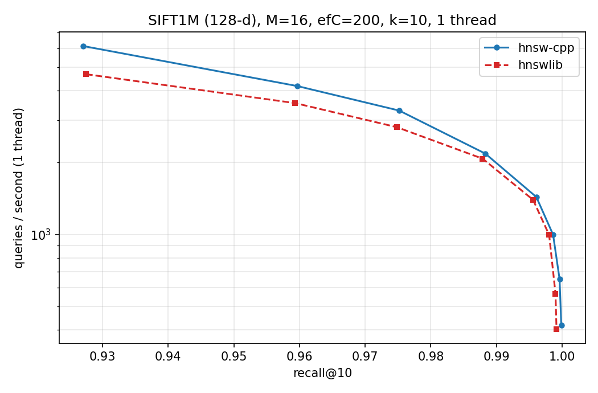
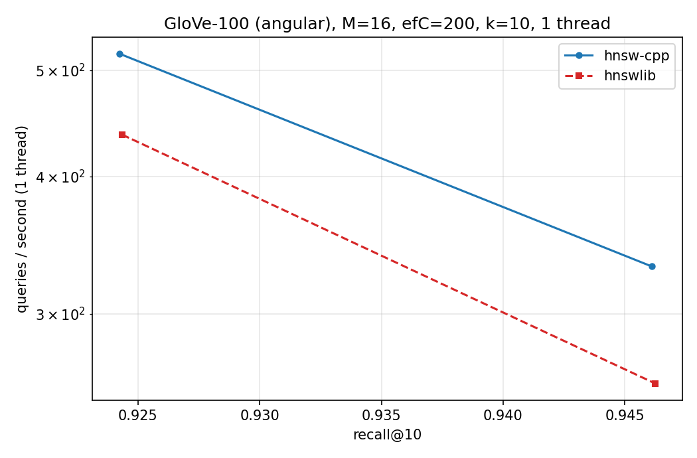

# HNSW in C++17

A from-scratch **HNSW** (Hierarchical Navigable Small World) approximate nearest-neighbour index,
built from the original paper (Malkov & Yashunin). Header-only, no dependencies, with a
multithreaded build, lock-free queries, an AVX2 distance kernel, a correctness suite that also runs
under ASan / UBSan / TSan, and a benchmark harness that measures **recall@10 vs queries-per-second**
against [hnswlib](https://github.com/nmslib/hnswlib) on the same data and ground truth.


```
include/hnsw.h        the index (~550 lines)
include/dataset.h     fvecs/ivecs IO, synthetic data, parallel brute-force ground truth
src/bench.cpp         recall@k vs QPS sweep -> CSV
tests/test_hnsw.cpp   unit/property tests
scripts/              dataset download, hnswlib baseline, plotting, result summary, run_all.sh
results/              CSVs, logs and plots produced by the benchmarks
```

## Highlights

* C++17, header-only HNSW index
* No runtime dependencies for the core index
* L2 distance with an AVX2+FMA fast path and portable scalar fallback
* Multithreaded index construction
* Lock-free queries after construction
* Deterministic level generation from `(seed, internal_id)`
* Flat layer-0 adjacency storage for better locality
* Best-first search with configurable `ef`
* Parallel brute-force ground truth generation
* Correctness and invariant tests
* Benchmark harness comparing against `hnswlib`
* Recall@10, single-thread QPS, multi-thread QPS, p50 and p99 latency
* SIFT1M and GloVe-100 benchmark datasets

## Quick start

### Build

Requires a C++17 compiler and `make`.

```bash
make
```

On macOS, Apple Clang works out of the box:

```bash
make CXX=clang++
```

### Run tests

```bash
make test
```

The test suite covers:

* tiny and edge-case indexes
* exact self matches
* recall against brute-force ground truth
* graph invariants
* result ordering
* parallel-build quality

Example output:

```text
tiny / edge cases
recall + invariants (single thread, 5k x 32d)
  recall@10 ef=10: 0.9320   ef=100: 1.0000  levels=2  avg deg0=18.0
exact self match
parallel build (8 threads) matches serial quality
result ordering

all tests passed
```

## Using the index

The core API is intentionally small:

```cpp
hnsw::Index::Params p;
p.dim = 128;
p.max_elements = 1'000'000;
p.M = 16;
p.ef_construction = 200;

hnsw::Index index(p);

index.add_batch(vectors, n, /*threads=*/8);

auto hits = index.search(
    query,
    /*k=*/10,
    /*ef=*/100
);
```

Search results are returned in ascending distance order.

For cosine/angular similarity, normalize vectors to unit length before indexing. The resulting nearest-neighbor ordering is equivalent to angular similarity.

## Benchmarking

The repository includes a reproducible benchmark harness for comparing this implementation with [`hnswlib`](https://github.com/nmslib/hnswlib).

The benchmark configuration used for the reported results is:

| Parameter        |  Value |
| ---------------- | -----: |
| `M`              |     16 |
| `efConstruction` |    200 |
| `k`              |     10 |
| Query `ef`       | 10–800 |
| Build threads    |      4 |
| Queries          | 10,000 |

Datasets:

* **SIFT1M:** 1,000,000 vectors × 128 dimensions, L2 distance
* **GloVe-100:** 1,183,514 vectors × 100 dimensions, angular distance

The benchmark records:

* recall@10
* single-thread query QPS
* multi-thread query QPS
* p50 latency
* p99 latency
* build time
* memory usage

Raw CSVs, logs, plots, and the recorded environment are available under [`results/`](results/).

### Reproducing the benchmark

Create the Python environment:

```bash
python3 -m venv .venv
source .venv/bin/activate

pip install numpy matplotlib h5py hnswlib
```

Then run:

```bash
scripts/run_all.sh 4
```

The script:

1. builds the C++ implementation
2. runs the correctness tests
3. downloads the benchmark datasets when needed
4. converts GloVe HDF5 data to `fvecs`
5. runs hnsw-cpp
6. runs hnswlib with the same HNSW parameters
7. generates CSV results and plots
8. writes benchmark logs and summary information

> **Runtime note:** the full benchmark can take many hours on a laptop because `--compare-build` also measures a single-thread build of the full datasets. The reported run was performed on a 4-core Intel Mac.

Datasets are intentionally excluded from Git via `.gitignore`.

## Measured results

The following results were measured on an Intel Mac, x86_64, with Apple Clang 16, using four build/query threads.

### SIFT1M

Configuration:

* 1,000,000 × 128-d vectors
* L2 distance
* `M=16`
* `efConstruction=200`
* 10,000 queries
* 4-thread build

#### Build

| Implementation      |   Build time |
| ------------------- | -----------: |
| hnsw-cpp, 4 threads | **415.96 s** |
| hnsw-cpp, 1 thread  | **676.70 s** |

This corresponds to a **1.63× build speedup** from four threads.

#### Query performance

At approximately fixed recall, hnsw-cpp achieved higher single-thread query throughput in the measured SIFT run:

| Target recall@10 | hnsw-cpp QPS | hnswlib QPS |     Ratio |
| ---------------: | -----------: | ----------: | --------: |
|             0.90 |        7,462 |       5,186 | **1.44×** |
|             0.95 |        4,676 |       3,842 | **1.22×** |
|             0.99 |        1,990 |       1,863 | **1.07×** |

The raw sweep is available in:

```text
results/sift_cpp.csv
results/sift_hnswlib.csv
```

### SIFT recall/QPS



### GloVe-100

Configuration:

* 1,183,514 × 100-d vectors
* angular distance
* `M=16`
* `efConstruction=200`
* 10,000 queries
* 4-thread build

#### Build

| Implementation      |   Build time |
| ------------------- | -----------: |
| hnsw-cpp, 4 threads | **456.70 s** |
| hnswlib, 4 threads  | **648.20 s** |

For hnsw-cpp, the measured four-thread build was **98.26× faster than its own single-thread comparison build** on this dataset. The single-thread GloVe comparison build took approximately 12.5 hours, so build-thread comparisons should be interpreted in the context of this implementation and machine rather than as a general claim about HNSW libraries.

#### Query performance

GloVe reached approximately 0.90 recall at:

| Target recall@10 | hnsw-cpp QPS | hnswlib QPS |     Ratio |
| ---------------: | -----------: | ----------: | --------: |
|             0.90 |          745 |         633 | **1.18×** |

The maximum measured recall in this sweep was approximately 0.946 for both implementations.

Raw results are available in:

```text
results/glove_cpp.csv
results/glove_hnswlib.csv
```

### GloVe recall/QPS



## Benchmark interpretation

These results are **measurements from one machine**, not universal performance claims.

The benchmark is intended to answer a practical question:

> How does a compact from-scratch HNSW implementation behave relative to a mature C++ HNSW implementation under the same graph parameters and dataset?

The comparison is strongest when looking at the complete recall/QPS curves rather than a single operating point.

The raw measurements are committed under `results/` so the reported numbers can be inspected rather than treated as headline-only claims.

## Design notes

### Hierarchical graph structure

Each point is assigned a maximum layer using a geometric distribution:

```text
floor(-ln(U) / ln(M))
```

The level is generated from a `splitmix64`-based function of the seed and internal ID, avoiding contention around a shared random-number generator.

Layer 0 contains every point and supports up to `2M` connections. Higher layers contain progressively fewer points and support up to `M` connections.

### Search

Search follows the standard HNSW structure:

1. Greedy 1-nearest-neighbor descent through the upper layers.
2. Best-first exploration at layer 0.
3. Maintain the closest `ef` candidates.
4. Return the best `k` results.

Increasing `ef` generally increases recall while reducing query throughput.

### Neighbor selection

The implementation uses the HNSW diversity heuristic rather than simply taking the nearest `M` candidates.

This encourages edges to span different directions in the local neighborhood, improving navigability on clustered data.

Reverse edges are also pruned when a neighbor list exceeds its capacity.

### Memory layout

Vectors are stored in one contiguous array.

Layer-0 adjacency is stored as flat per-node blocks rather than pointer-heavy graph objects. Upper-layer adjacency uses per-node vectors because relatively few nodes reach those levels.

The search path also uses:

* software prefetching for neighbor data
* an epoch-based visited set
* `thread_local` search state

These choices reduce allocation and pointer-chasing overhead in the hot path.

## Concurrency

Index construction uses fine-grained locking:

* one mutex per node protects its neighbor lists
* at most one node lock is held by an insertion at a time
* a global lock is used only when an insertion raises the maximum graph level
* queries after construction require no locks

The implementation also performs a connectivity-repair pass after parallel construction.

Concurrent insertion can otherwise produce an algorithmic issue where two simultaneous insertions fail to see one another, allowing a node to become unreachable from the entry point. This is not a data race.

The repair pass reconnects orphaned nodes to reachable neighbors when possible.

The test suite also includes parallel-build quality checks.

## Testing

The repository includes correctness and stress tests for:

* graph construction
* recall against brute-force search
* exact self-match behavior
* result ordering
* graph invariants
* serial vs parallel construction quality

Sanitizer targets are available through the Makefile:

```bash
make asan
make tsan
```

These targets are intended for local correctness/debugging runs.

## Project structure

```text
.
├── include/
│   ├── hnsw.h          # HNSW index implementation
│   └── dataset.h       # fvecs/ivecs I/O and dataset utilities
├── src/
│   └── bench.cpp       # C++ benchmark harness
├── tests/
│   └── test_hnsw.cpp   # correctness and invariant tests
├── scripts/
│   ├── fetch_data.sh
│   ├── hdf5_to_fvecs.py
│   ├── bench_hnswlib.py
│   ├── plot.py
│   ├── summarize.py
│   └── run_all.sh
├── results/
│   ├── *.csv            # raw benchmark data
│   ├── *.log            # benchmark logs
│   ├── *.png            # recall/QPS plots
│   └── environment.txt # recorded benchmark environment
├── Makefile
└── README.md
```

## Limitations

This implementation is intentionally focused rather than feature-complete.

Current limitations:

* L2 distance is implemented directly; angular/cosine search uses normalized vectors
* no inner-product metric
* no deletion
* no update operation
* no persistence/save/load
* fixed index capacity
* parallel builds are not bit-for-bit reproducible because insertion order depends on thread scheduling
* AVX2+FMA acceleration is provided, but there is no AVX-512 or ARM NEON implementation

## Possible next steps

Potential extensions include:

* persistence with `save()` / `load()`
* dynamic resizing
* deletion/update support
* additional distance metrics
* AVX-512 and ARM NEON kernels
* scalar/int8 quantization
* further profiling of the remaining performance gap to mature HNSW implementations
* additional connectivity and concurrency strategies

## License

MIT License.
