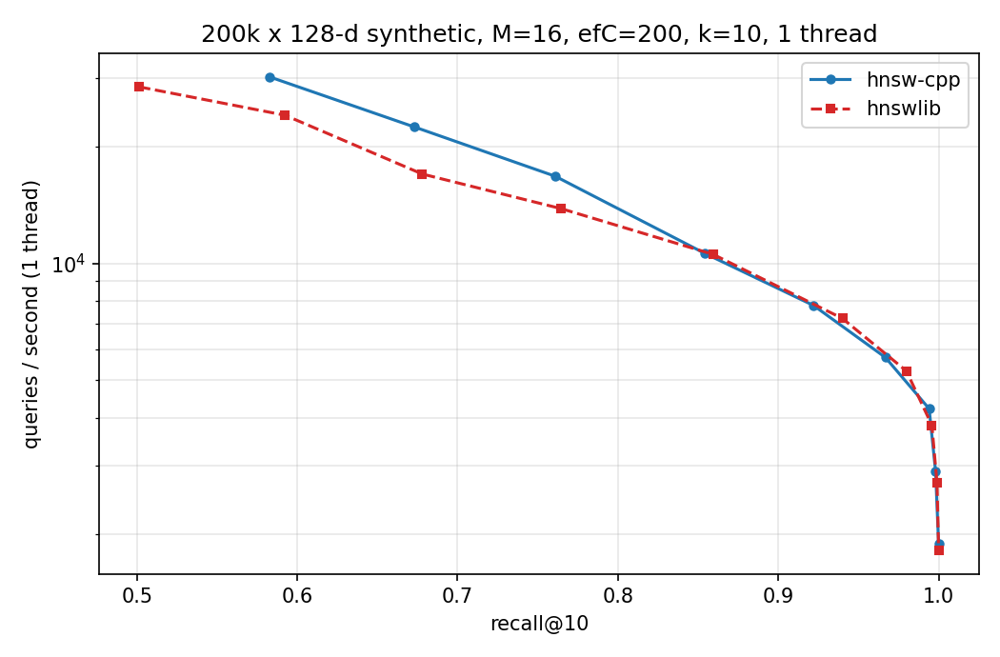

# HNSW in C++17

A from-scratch **HNSW** (Hierarchical Navigable Small World) approximate nearest-neighbour index,
built from the original paper (Malkov & Yashunin). Header-only, no dependencies, with a
multithreaded build, lock-free queries, an AVX2 distance kernel, a correctness suite that also runs
under ASan / UBSan / TSan, and a benchmark harness that measures **recall@10 vs queries-per-second**
against [hnswlib](https://github.com/nmslib/hnswlib) on the same data and ground truth.



```
include/hnsw.h        the index (~550 lines)
include/dataset.h     fvecs/ivecs IO, synthetic data, parallel brute-force ground truth
src/bench.cpp         recall@k vs QPS sweep -> CSV
tests/test_hnsw.cpp   unit/property tests
scripts/              dataset download, hnswlib baseline, plotting, result summary, run_all.sh
results/              CSVs, logs and plots produced by the benchmarks
```

## Quick start

Needs `g++` (C++17) and `make`. Linux, macOS or WSL.

```bash
make            # builds build/bench and build/test_hnsw  (-O3 -march=native)
make test       # correctness suite
make asan tsan  # same suite under AddressSanitizer+UBSan / ThreadSanitizer
```

```cpp
#include "hnsw.h"

hnsw::Index::Params p;
p.dim = 128; p.max_elements = 1'000'000; p.M = 16; p.ef_construction = 200;
hnsw::Index index(p);

index.add_batch(vectors, n, /*threads=*/8);             // row-major float*, label = row number
auto hits = index.search(query, /*k=*/10, /*ef=*/100);  // vector<pair<squared_dist, label>>, ascending
```

`ef` is the recall/speed knob: larger means higher recall and slower queries. For cosine / angular
similarity, L2-normalise vectors first (the nearest-neighbour ordering is identical).

## Benchmarks

### Run on the standard datasets (SIFT1M, GloVe-100)

```bash
python3 -m venv .venv && source .venv/bin/activate
pip install numpy matplotlib h5py hnswlib
scripts/run_all.sh 8        # 8 = number of threads
```

This builds, runs the tests, downloads both datasets from ann-benchmarks (ground truth included),
benchmarks hnsw-cpp and hnswlib with identical parameters (M=16, efC=200, k=10), writes CSVs, logs
and plots to `results/`, and prints a summary table. Query throughput is measured one query at a
time on a single thread (the ann-benchmarks convention); multi-thread throughput is also recorded
(`qps_mt` column). Manual use of the individual tools:

```bash
build/bench --base data/sift_base.fvecs --query data/sift_query.fvecs --gt data/sift_gt.ivecs \
            --metric l2 --M 16 --efc 200 --threads 8 --compare-build --out results/sift_cpp.csv
python3 scripts/bench_hnswlib.py --base data/sift_base.fvecs --query data/sift_query.fvecs \
            --gt data/sift_gt.ivecs --M 16 --efc 200 --threads 8 --out results/sift_hnswlib.csv
python3 scripts/plot.py results/sift_cpp.csv results/sift_hnswlib.csv -o results/sift.png
```

### Results

> These are **synthetic-data** results from a single-core machine. They validate the implementation
> and the methodology; the SIFT1M / GloVe-100 results come from `scripts/run_all.sh` above.

200k x 128-d Gaussian-mixture vectors, 1000 queries, M=16, efC=200, k=10, 1 thread, same data and
ground truth for both implementations:

| target recall@10 | hnsw-cpp (q/s) | hnswlib 0.8.0 (q/s) | ratio |
|---|---|---|---|
| 0.90 | 8,608 | 8,708 | 0.99x |
| 0.95 | 6,420 | 6,667 | 0.96x |
| 0.99 | 4,414 | 4,300 | 1.03x |

QPS is interpolated at fixed recall, since the two graphs reach slightly different recall at the
same `ef`. Raw sweeps are in `results/`. Single-thread build of 200k points: 48.6 s (hnsw-cpp) vs
54.5 s (hnswlib). Caveats: synthetic data, one machine; the timing harnesses differ (a C++ per-query
loop vs hnswlib's batched call from Python); hnswlib dispatches AVX/AVX-512 at runtime while this
uses AVX2+FMA.

## Design notes

**Structure.** Each point gets a max layer `floor(-ln(U) / ln M)`. Layer 0 holds every point with up
to `2M` links; layers >= 1 hold exponentially fewer points with up to `M` links. The level is a pure
function of `(seed, internal id)` (splitmix64), so there is no shared RNG to contend on.

**Search (paper Alg. 5).** Greedy 1-NN descent from the entry point through the upper layers, then a
best-first search on layer 0 that keeps the `ef` closest elements.

**Neighbour selection (Alg. 4).** The heuristic keeps a candidate only if it is closer to the new
point than to every neighbour already kept. That spreads edges across directions instead of taking
the M nearest (which all sit in one cluster) and keeps clustered data navigable. The same heuristic
shrinks a neighbour's list when a reverse edge overflows it.

**Memory layout.** Vectors are one contiguous array. Layer-0 links are a flat `[count, ids...]`
block per node (no pointer chasing); upper layers are per-node vectors since few nodes have them.
Neighbour vectors are software-prefetched before the distance loop, and the visited set resets in
O(1) with an epoch counter in a `thread_local` array.

**Concurrency.**
- One mutex per node guards that node's neighbour lists. A thread holds at most one node lock at a
  time, so lock-order deadlock cannot happen by construction.
- A global mutex is taken only by an insert that will raise the top layer (rare).
- A node's vector and level are written before it becomes reachable: it links itself first, then its
  neighbours link back. Queries after the build take no locks.
- The test suite is clean under ThreadSanitizer, AddressSanitizer and UBSan.

**Concurrent inserts can orphan nodes.** Two inserts running at the same moment cannot see each
other, so one can be pruned out of every neighbour list and end up (with anything only reachable
through it) with no path from the entry point. In an 8-thread build of 20k points this affected
0.1-0.5% of nodes (serial builds: about 0-0.02%), growing with thread count. It is an algorithmic
effect, not a data race: TSan is clean, and running 8 threads with every `add()` behind one big lock
reproduces the serial result. `repair_connectivity()` runs at the end of `add_batch`: for each orphan
it finds the nearest reachable nodes and adds an edge from the first one that can spare a slot
without orphaning anyone else (target in-degree > 1). After repair the parallel builds I tested had 0
unreachable nodes and recall within about 0.5% of serial.

## Limitations and next steps

- L2 only (cosine via normalisation). No inner-product metric, deletion, update or persistence.
- Fixed capacity (`max_elements`), no resizing.
- Parallel builds are not bit-reproducible (internal ids follow thread arrival order).
- The distance kernel is AVX2+FMA or portable scalar; no AVX-512 / NEON path.
- Ideas with measurable payoffs: `keepPrunedConnections`, int8 / scalar quantisation (memory vs
  recall), `save()` / `load()`, and a profile-guided look at the remaining gap to hnswlib.

## License

MIT
